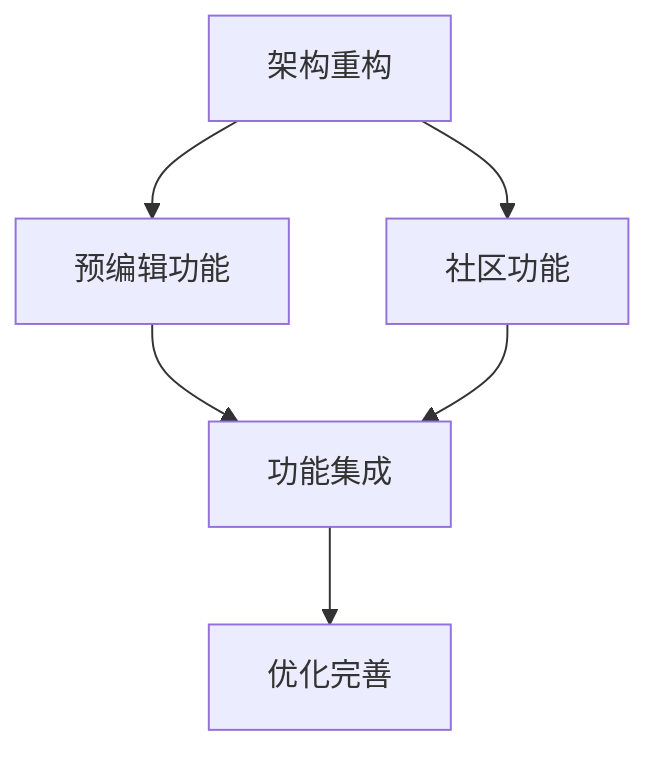

# 🚀 Artist Generator 未来功能规划

## 📋 功能需求概述

基于用户反馈和产品发展需要，计划实现以下三个核心功能：

1. **画师预编辑功能** - 标签化管理和预设画师组合
2. **用户分享功能** - 优秀画师串的社区分享
3. **网站架构优化** - 现代化用户体验重构

---

## 🎯 功能1：画师预编辑功能

### 需求描述

- 支持以标签为单位对画师进行预编辑
- 可调用历史画师串作为基础
- 预先选择画师并设置权重
- 基于预设画师进行随机生成

### 技术架构设计

#### 数据结构

```typescript
// 画师标签
interface ArtistTag {
  id: string
  name: string
  color: string
  description?: string
  createdAt: Date
}

// 预编辑画师组合
interface PresetArtistGroup {
  id: string
  name: string
  description: string
  tags: string[]
  artists: PresetArtist[]
  isPublic: boolean
  createdAt: Date
  updatedAt: Date
}

// 预设画师（带权重）
interface PresetArtist {
  artistName: string
  weight: number
  isFixed: boolean // 是否固定包含
  tags: string[]
}
```

#### 组件设计

```
src/components/preset/
├── PresetEditor.vue          # 预编辑主界面
├── ArtistTagManager.vue      # 标签管理
├── PresetArtistCard.vue      # 预设画师卡片
├── HistoryImporter.vue       # 历史记录导入
└── WeightAdjuster.vue        # 权重调节器
```

#### 功能特性

- **标签系统**：颜色分类、快速筛选
- **权重可视化**：滑块调节、实时预览
- **历史集成**：一键导入历史组合
- **模板保存**：本地存储、云端同步

---

## 🌟 功能2：用户分享功能

### 需求描述

- 用户可分享优秀的画师串组合
- 支持填写名称、简介、画师串
- 社区投票和评分系统
- 热门推荐和分类浏览

### 技术架构设计

#### 数据结构

```typescript
// 分享的画师串
interface SharedArtistString {
  id: string
  title: string
  description: string
  artistString: string
  author: string
  authorId?: string
  tags: string[]
  likes: number
  views: number
  rating: number
  isVerified: boolean
  createdAt: Date
}

// 用户评价
interface UserReview {
  id: string
  stringId: string
  userId: string
  rating: number
  comment: string
  createdAt: Date
}
```

#### 组件设计

```
src/components/community/
├── ShareDialog.vue           # 分享对话框
├── CommunityFeed.vue         # 社区动态
├── StringCard.vue            # 画师串卡片
├── RatingSystem.vue          # 评分系统
├── TagFilter.vue             # 标签筛选
└── UserProfile.vue           # 用户资料
```

#### 存储方案

- **本地存储**：用户草稿、收藏列表
- **云端存储**：GitHub Issues API 或 Firebase
- **缓存策略**：热门内容本地缓存

---

## 🎨 功能3：网站架构优化

### 需求描述

- 重构为现代化的多页面应用
- 符合人类操作习惯的交互设计
- 响应式设计和无障碍访问
- 性能优化和SEO友好

### 技术架构设计

#### 页面结构

```
src/views/
├── Home.vue                  # 首页 - 快速生成
├── Editor.vue                # 编辑器 - 高级功能
├── Community.vue             # 社区 - 分享浏览
├── Library.vue               # 画师库 - 浏览搜索
├── History.vue               # 历史 - 记录管理
└── Settings.vue              # 设置 - 个人偏好
```

#### 路由设计

```typescript
const routes = [
  { path: '/', component: Home },
  { path: '/editor', component: Editor },
  { path: '/community', component: Community },
  { path: '/library', component: Library },
  { path: '/history', component: History },
  { path: '/settings', component: Settings },
]
```

#### UI/UX 改进

- **导航系统**：侧边栏 + 面包屑导航
- **响应式布局**：移动端优先设计
- **主题系统**：明暗主题切换
- **快捷键支持**：键盘操作友好
- **无障碍访问**：ARIA 标签、屏幕阅读器支持

---

## 📊 实现优先级和依赖关系

### 开发阶段规划

#### 阶段1：基础架构重构 (2-3周)

- [ ] 多页面路由系统
- [ ] 响应式布局框架
- [ ] 组件库标准化
- [ ] 状态管理优化

#### 阶段2：画师预编辑功能 (2-3周)

- [ ] 标签系统实现
- [ ] 预设编辑器开发
- [ ] 历史记录集成
- [ ] 权重调节功能

#### 阶段3：社区分享功能 (3-4周)

- [ ] 分享机制设计
- [ ] 社区界面开发
- [ ] 评分系统实现
- [ ] 数据存储方案

#### 阶段4：优化和完善 (1-2周)

- [ ] 性能优化
- [ ] 用户体验测试
- [ ] 文档完善
- [ ] 部署优化

### 技术依赖关系



---

## 🛠️ 技术栈选择

### 前端技术

- **框架**：Vue 3 + TypeScript (保持现有)
- **路由**：Vue Router 4 (升级使用)
- **状态管理**：Pinia (保持现有)
- **UI框架**：TailwindCSS + HeadlessUI
- **构建工具**：Vite (保持现有)

### 数据存储

- **本地存储**：IndexedDB + LocalStorage
- **云端存储**：GitHub API / Firebase (待选择)
- **缓存策略**：Service Worker + Cache API

### 开发工具

- **代码质量**：ESLint + Prettier (保持现有)
- **测试框架**：Vitest + Vue Test Utils
- **文档工具**：VitePress
- **部署方案**：GitHub Pages (保持现有)

---

## 📈 成功指标

### 用户体验指标

- 页面加载时间 < 2秒
- 交互响应时间 < 100ms
- 移动端适配评分 > 95%
- 无障碍访问评分 > 90%

### 功能使用指标

- 预编辑功能使用率 > 30%
- 社区分享参与率 > 15%
- 用户留存率提升 > 20%
- 功能满意度评分 > 4.5/5

---

## 🚧 风险评估和缓解策略

### 技术风险

- **数据迁移风险**：制定详细的数据迁移计划
- **性能影响风险**：分阶段发布，监控性能指标
- **兼容性风险**：保持向后兼容，渐进式升级

### 产品风险

- **用户接受度风险**：用户测试和反馈收集
- **功能复杂度风险**：MVP优先，迭代完善
- **维护成本风险**：代码质量保证，文档完善

---

## 📝 下一步行动

1. **用户调研**：收集用户对新功能的具体需求
2. **技术验证**：关键技术点的可行性验证
3. **原型设计**：制作交互原型进行用户测试
4. **开发计划**：制定详细的开发时间表

**准备开始实施吗？请确认优先级和技术方案选择。**