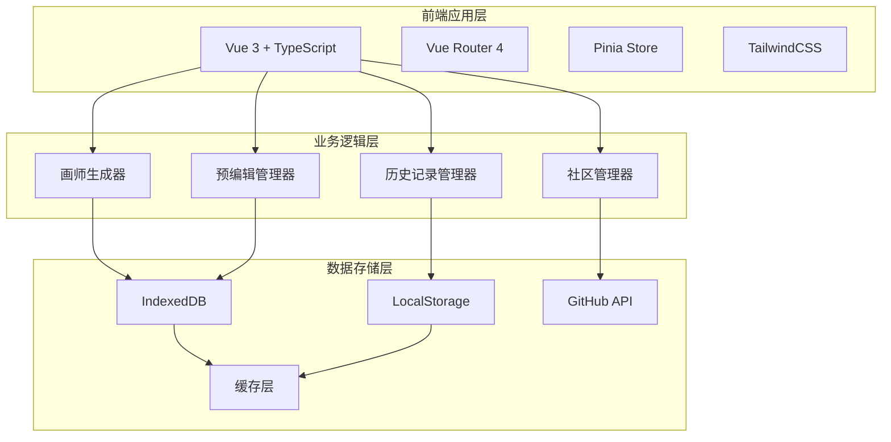

# 🔧 Artist Generator 技术设计文档

## 📐 系统架构设计

### 整体架构图



---

## 🗂️ 数据模型设计

### 核心数据结构

#### 1. 画师预编辑相关

```typescript
// 画师标签
interface ArtistTag {
  id: string
  name: string
  color: string
  description?: string
  createdAt: Date
  updatedAt: Date
}

// 预编辑画师组合
interface PresetArtistGroup {
  id: string
  name: string
  description: string
  tags: string[]
  artists: PresetArtist[]
  isPublic: boolean
  isFavorite: boolean
  usageCount: number
  createdAt: Date
  updatedAt: Date
}

// 预设画师（带权重和配置）
interface PresetArtist {
  id: string
  artistName: string
  weight: number
  isFixed: boolean // 是否固定包含在生成中
  isOptional: boolean // 是否可选
  tags: string[]
  position?: number // 在组合中的位置
  notes?: string // 备注信息
}

// 画师编辑历史
interface ArtistEditHistory {
  id: string
  groupId: string
  action: 'create' | 'update' | 'delete' | 'import'
  changes: Record<string, any>
  timestamp: Date
}
```

#### 2. 社区分享相关

```typescript
// 分享的画师串
interface SharedArtistString {
  id: string
  title: string
  description: string
  artistString: string
  formattedString: string
  author: string
  authorId?: string
  tags: string[]
  category: 'style' | 'character' | 'scene' | 'mixed'
  difficulty: 'beginner' | 'intermediate' | 'advanced'
  likes: number
  dislikes: number
  views: number
  downloads: number
  rating: number
  ratingCount: number
  isVerified: boolean
  isFeatured: boolean
  language: string
  createdAt: Date
  updatedAt: Date
}

// 用户评价和评论
interface UserReview {
  id: string
  stringId: string
  userId: string
  userName: string
  rating: number
  comment: string
  likes: number
  isVerified: boolean
  createdAt: Date
}

// 用户收藏
interface UserFavorite {
  id: string
  userId: string
  stringId: string
  folderId?: string
  createdAt: Date
}

// 收藏夹
interface FavoriteFolder {
  id: string
  userId: string
  name: string
  description?: string
  isPublic: boolean
  stringIds: string[]
  createdAt: Date
  updatedAt: Date
}
```

#### 3. 用户系统相关

```typescript
// 用户配置文件
interface UserProfile {
  id: string
  username: string
  displayName: string
  avatar?: string
  bio?: string
  level: number
  experience: number
  badges: string[]
  preferences: UserPreferences
  statistics: UserStatistics
  createdAt: Date
  lastActiveAt: Date
}

// 用户统计
interface UserStatistics {
  totalGenerations: number
  totalShares: number
  totalLikes: number
  totalDownloads: number
  favoriteStyles: string[]
  activeStreak: number
  longestStreak: number
}

// 扩展的用户偏好
interface UserPreferences {
  // 现有设置
  favoritePresets: string[]
  customPresets: PresetConfig[]
  recentGenerations: GenerationResult[]
  settings: {
    enableHapticFeedback: boolean
    enableVoiceInput: boolean
    preferredTheme: 'light' | 'dark' | 'auto'
    enableAnimations: boolean
    language: string
    autoSave: boolean
    showTutorials: boolean
  }

  // 新增设置
  editor: {
    defaultTagColors: Record<string, string>
    autoTagSuggestions: boolean
    showWeightPreview: boolean
    enableKeyboardShortcuts: boolean
  }

  community: {
    showNSFWContent: boolean
    defaultSortOrder: 'newest' | 'popular' | 'rating'
    enableNotifications: boolean
    autoFollowFeatured: boolean
  }
}
```

---

## 🏗️ 组件架构设计

### 组件层次结构

```
src/
├── components/
│   ├── common/                    # 通用组件
│   │   ├── BaseButton.vue
│   │   ├── BaseInput.vue
│   │   ├── BaseModal.vue
│   │   ├── LoadingSpinner.vue
│   │   ├── NotificationToast.vue
│   │   └── Pagination.vue
│   │
│   ├── layout/                    # 布局组件
│   │   ├── AppHeader.vue
│   │   ├── AppSidebar.vue
│   │   ├── AppFooter.vue
│   │   └── BreadcrumbNav.vue
│   │
│   ├── artist/                    # 画师相关组件
│   │   ├── ArtistCard.vue
│   │   ├── ArtistDetail.vue
│   │   ├── ArtistLibrary.vue
│   │   └── ArtistSearch.vue
│   │
│   ├── preset/                    # 预编辑功能组件
│   │   ├── PresetEditor.vue       # 主编辑器
│   │   ├── ArtistTagManager.vue   # 标签管理
│   │   ├── PresetArtistCard.vue   # 预设画师卡片
│   │   ├── WeightAdjuster.vue     # 权重调节器
│   │   ├── HistoryImporter.vue    # 历史导入
│   │   └── PresetLibrary.vue      # 预设库
│   │
│   ├── community/                 # 社区功能组件
│   │   ├── ShareDialog.vue        # 分享对话框
│   │   ├── CommunityFeed.vue      # 社区动态
│   │   ├── StringCard.vue         # 画师串卡片
│   │   ├── RatingSystem.vue       # 评分系统
│   │   ├── CommentSection.vue     # 评论区
│   │   ├── TagFilter.vue          # 标签筛选
│   │   ├── UserProfile.vue        # 用户资料
│   │   └── FavoriteManager.vue    # 收藏管理
│   │
│   ├── generator/                 # 生成器组件
│   │   ├── GeneratorMain.vue      # 主生成器
│   │   ├── PresetSelector.vue     # 预设选择器
│   │   ├── ResultDisplay.vue      # 结果显示
│   │   └── QuickActions.vue       # 快速操作
│   │
│   └── history/                   # 历史记录组件
│       ├── HistoryPanel.vue
│       ├── HistoryItem.vue
│       └── HistorySearch.vue
│
├── views/                         # 页面组件
│   ├── Home.vue                   # 首页
│   ├── Editor.vue                 # 编辑器页面
│   ├── Community.vue              # 社区页面
│   ├── Library.vue                # 画师库页面
│   ├── History.vue                # 历史页面
│   └── Settings.vue               # 设置页面
│
├── stores/                        # 状态管理
│   ├── generator.ts               # 生成器状态
│   ├── preset.ts                  # 预编辑状态
│   ├── community.ts               # 社区状态
│   ├── user.ts                    # 用户状态
│   └── app.ts                     # 应用全局状态
│
├── services/                      # 业务服务
│   ├── artistService.ts           # 画师服务
│   ├── presetService.ts           # 预编辑服务
│   ├── communityService.ts        # 社区服务
│   ├── storageService.ts          # 存储服务
│   └── apiService.ts              # API服务
│
└── utils/                         # 工具函数
    ├── storage.ts                 # 存储工具
    ├── validation.ts              # 验证工具
    ├── formatting.ts              # 格式化工具
    └── constants.ts               # 常量定义
```

---

## 🔄 状态管理设计

### Pinia Store 结构

#### 1. 预编辑状态管理 (preset.ts)

```typescript
export const usePresetStore = defineStore('preset', {
  state: () => ({
    // 当前编辑的预设组合
    currentGroup: null as PresetArtistGroup | null,

    // 所有预设组合
    groups: [] as PresetArtistGroup[],

    // 标签管理
    tags: [] as ArtistTag[],

    // 编辑历史
    editHistory: [] as ArtistEditHistory[],

    // UI状态
    isEditing: false,
    selectedArtists: [] as string[],
    draggedArtist: null as PresetArtist | null,

    // 搜索和筛选
    searchQuery: '',
    selectedTags: [] as string[],
    sortBy: 'name' as 'name' | 'weight' | 'usage',
  }),

  getters: {
    // 过滤后的预设组合
    filteredGroups: (state) => {
      return state.groups.filter((group) => {
        const matchesSearch = group.name.toLowerCase().includes(state.searchQuery.toLowerCase())
        const matchesTags =
          state.selectedTags.length === 0 ||
          state.selectedTags.some((tag) => group.tags.includes(tag))
        return matchesSearch && matchesTags
      })
    },

    // 当前组合的画师统计
    currentGroupStats: (state) => {
      if (!state.currentGroup) return null
      return {
        totalArtists: state.currentGroup.artists.length,
        fixedArtists: state.currentGroup.artists.filter((a) => a.isFixed).length,
        totalWeight: state.currentGroup.artists.reduce((sum, a) => sum + a.weight, 0),
        averageWeight:
          state.currentGroup.artists.length > 0
            ? state.currentGroup.artists.reduce((sum, a) => sum + a.weight, 0) /
              state.currentGroup.artists.length
            : 0,
      }
    },
  },

  actions: {
    // 创建新的预设组合
    async createGroup(group: Omit<PresetArtistGroup, 'id' | 'createdAt' | 'updatedAt'>) {
      const newGroup: PresetArtistGroup = {
        ...group,
        id: generateId(),
        createdAt: new Date(),
        updatedAt: new Date(),
      }
      this.groups.push(newGroup)
      await this.saveToStorage()
      return newGroup
    },

    // 更新预设组合
    async updateGroup(id: string, updates: Partial<PresetArtistGroup>) {
      const index = this.groups.findIndex((g) => g.id === id)
      if (index !== -1) {
        this.groups[index] = {
          ...this.groups[index],
          ...updates,
          updatedAt: new Date(),
        }
        await this.saveToStorage()
      }
    },

    // 添加画师到当前组合
    addArtistToGroup(artist: Omit<PresetArtist, 'id'>) {
      if (!this.currentGroup) return

      const newArtist: PresetArtist = {
        ...artist,
        id: generateId(),
      }

      this.currentGroup.artists.push(newArtist)
      this.recordEdit('add_artist', { artist: newArtist })
    },

    // 从历史记录导入
    async importFromHistory(historyItem: GenerationResult) {
      const artists: PresetArtist[] = historyItem.artists.map((name, index) => ({
        id: generateId(),
        artistName: name,
        weight: historyItem.weights[index] || 1.0,
        isFixed: false,
        isOptional: false,
        tags: [],
      }))

      const group = await this.createGroup({
        name: `从历史导入 - ${new Date().toLocaleDateString()}`,
        description: `导入自 ${historyItem.timestamp.toLocaleString()}`,
        tags: [],
        artists,
        isPublic: false,
        isFavorite: false,
        usageCount: 0,
      })

      this.currentGroup = group
    },

    // 记录编辑操作
    recordEdit(action: string, changes: any) {
      if (!this.currentGroup) return

      const edit: ArtistEditHistory = {
        id: generateId(),
        groupId: this.currentGroup.id,
        action: action as any,
        changes,
        timestamp: new Date(),
      }

      this.editHistory.push(edit)

      // 限制历史记录数量
      if (this.editHistory.length > 100) {
        this.editHistory = this.editHistory.slice(-100)
      }
    },

    // 保存到本地存储
    async saveToStorage() {
      await storageService.setItem('preset_groups', this.groups)
      await storageService.setItem('preset_tags', this.tags)
    },

    // 从本地存储加载
    async loadFromStorage() {
      this.groups = (await storageService.getItem('preset_groups')) || []
      this.tags = (await storageService.getItem('preset_tags')) || []
    },
  },
})
```

#### 2. 社区状态管理 (community.ts)

```typescript
export const useCommunityStore = defineStore('community', {
  state: () => ({
    // 分享的画师串
    sharedStrings: [] as SharedArtistString[],

    // 当前用户的分享
    myShares: [] as SharedArtistString[],

    // 收藏相关
    favorites: [] as UserFavorite[],
    favoriteFolders: [] as FavoriteFolder[],

    // 评论和评分
    reviews: [] as UserReview[],

    // UI状态
    isLoading: false,
    currentPage: 1,
    totalPages: 1,
    sortBy: 'newest' as 'newest' | 'popular' | 'rating',
    filterBy: 'all' as 'all' | 'style' | 'character' | 'scene' | 'mixed',
    searchQuery: '',
    selectedTags: [] as string[],

    // 分享对话框状态
    shareDialog: {
      isOpen: false,
      editingString: null as SharedArtistString | null,
    },
  }),

  getters: {
    // 过滤和排序后的画师串
    filteredStrings: (state) => {
      let filtered = state.sharedStrings.filter((str) => {
        const matchesSearch =
          str.title.toLowerCase().includes(state.searchQuery.toLowerCase()) ||
          str.description.toLowerCase().includes(state.searchQuery.toLowerCase())
        const matchesCategory = state.filterBy === 'all' || str.category === state.filterBy
        const matchesTags =
          state.selectedTags.length === 0 ||
          state.selectedTags.some((tag) => str.tags.includes(tag))
        return matchesSearch && matchesCategory && matchesTags
      })

      // 排序
      switch (state.sortBy) {
        case 'popular':
          filtered.sort((a, b) => b.likes + b.downloads - (a.likes + a.downloads))
          break
        case 'rating':
          filtered.sort((a, b) => b.rating - a.rating)
          break
        case 'newest':
        default:
          filtered.sort((a, b) => b.createdAt.getTime() - a.createdAt.getTime())
          break
      }

      return filtered
    },

    // 热门标签
    popularTags: (state) => {
      const tagCounts = new Map<string, number>()
      state.sharedStrings.forEach((str) => {
        str.tags.forEach((tag) => {
          tagCounts.set(tag, (tagCounts.get(tag) || 0) + 1)
        })
      })

      return Array.from(tagCounts.entries())
        .sort((a, b) => b[1] - a[1])
        .slice(0, 20)
        .map(([tag]) => tag)
    },
  },

  actions: {
    // 分享画师串
    async shareArtistString(
      data: Omit<
        SharedArtistString,
        | 'id'
        | 'likes'
        | 'views'
        | 'downloads'
        | 'rating'
        | 'ratingCount'
        | 'createdAt'
        | 'updatedAt'
      >,
    ) {
      const newString: SharedArtistString = {
        ...data,
        id: generateId(),
        likes: 0,
        dislikes: 0,
        views: 0,
        downloads: 0,
        rating: 0,
        ratingCount: 0,
        createdAt: new Date(),
        updatedAt: new Date(),
      }

      // 保存到云端存储
      await communityService.shareString(newString)

      this.sharedStrings.unshift(newString)
      this.myShares.unshift(newString)

      return newString
    },

    // 点赞/取消点赞
    async toggleLike(stringId: string) {
      const string = this.sharedStrings.find((s) => s.id === stringId)
      if (!string) return

      // 这里应该调用API更新点赞状态
      // 暂时本地更新
      string.likes += 1

      await communityService.updateLikes(stringId, string.likes)
    },

    // 添加到收藏
    async addToFavorites(stringId: string, folderId?: string) {
      const favorite: UserFavorite = {
        id: generateId(),
        userId: 'current_user', // 实际应该从用户状态获取
        stringId,
        folderId,
        createdAt: new Date(),
      }

      this.favorites.push(favorite)
      await storageService.setItem('user_favorites', this.favorites)
    },

    // 加载社区数据
    async loadCommunityData(page = 1) {
      this.isLoading = true
      try {
        const result = await communityService.getSharedStrings({
          page,
          sortBy: this.sortBy,
          filterBy: this.filterBy,
          searchQuery: this.searchQuery,
          tags: this.selectedTags,
        })

        this.sharedStrings = result.strings
        this.currentPage = result.currentPage
        this.totalPages = result.totalPages
      } finally {
        this.isLoading = false
      }
    },
  },
})
```

---

## 🌐 API 设计

### RESTful API 端点

#### 社区功能 API

```typescript
// 获取分享的画师串列表
GET /api/community/strings
Query: page, limit, sort, category, tags, search

// 获取单个画师串详情
GET /api/community/strings/:id

// 分享新的画师串
POST /api/community/strings
Body: SharedArtistString

// 更新画师串
PUT /api/community/strings/:id
Body: Partial<SharedArtistString>

// 删除画师串
DELETE /api/community/strings/:id

// 点赞/取消点赞
POST /api/community/strings/:id/like
PUT /api/community/strings/:id/like

// 获取评论
GET /api/community/strings/:id/reviews
Query: page, limit

// 添加评论
POST /api/community/strings/:id/reviews
Body: UserReview

// 获取用户收藏
GET /api/users/:userId/favorites
Query: page, limit

// 添加收藏
POST /api/users/:userId/favorites
Body: { stringId, folderId? }
```

#### 数据同步 API

```typescript
// 同步用户数据
POST /api/sync/user-data
Body: { presets, favorites, settings }

// 获取用户数据
GET /api/sync/user-data/:userId

// 备份数据
POST /api/backup/create
Body: { data: any }

// 恢复数据
POST /api/backup/restore
Body: { backupId: string }
```

---

## 💾 存储方案设计

### 本地存储策略

#### IndexedDB 结构

```typescript
// 数据库版本和结构
const DB_NAME = 'ArtistGeneratorDB'
const DB_VERSION = 2

const stores = {
  // 预设组合
  presetGroups: {
    keyPath: 'id',
    indexes: ['name', 'createdAt', 'tags', 'isPublic'],
  },

  // 标签
  tags: {
    keyPath: 'id',
    indexes: ['name', 'color'],
  },

  // 历史记录
  history: {
    keyPath: 'id',
    indexes: ['timestamp', 'presetUsed'],
  },

  // 用户设置
  settings: {
    keyPath: 'key',
  },

  // 缓存数据
  cache: {
    keyPath: 'key',
    indexes: ['expiry'],
  },
}
```

#### 缓存策略

```typescript
class CacheManager {
  private readonly CACHE_DURATION = {
    community: 5 * 60 * 1000, // 5分钟
    artists: 24 * 60 * 60 * 1000, // 24小时
    user: 60 * 60 * 1000, // 1小时
  }

  async get<T>(key: string, type: keyof typeof this.CACHE_DURATION): Promise<T | null> {
    const cached = await storageService.getItem(`cache_${key}`)
    if (!cached) return null

    const now = Date.now()
    if (now - cached.timestamp > this.CACHE_DURATION[type]) {
      await storageService.removeItem(`cache_${key}`)
      return null
    }

    return cached.data
  }

  async set<T>(key: string, data: T): Promise<void> {
    await storageService.setItem(`cache_${key}`, {
      data,
      timestamp: Date.now(),
    })
  }
}
```

---

## 🎨 UI/UX 设计规范

### 设计系统

#### 颜色系统

```css
:root {
  /* 主色调 */
  --primary-50: #eff6ff;
  --primary-500: #3b82f6;
  --primary-600: #2563eb;
  --primary-700: #1d4ed8;

  /* 辅助色 */
  --secondary-50: #f8fafc;
  --secondary-500: #64748b;
  --secondary-600: #475569;

  /* 功能色 */
  --success-500: #10b981;
  --warning-500: #f59e0b;
  --error-500: #ef4444;

  /* 中性色 */
  --gray-50: #f9fafb;
  --gray-100: #f3f4f6;
  --gray-200: #e5e7eb;
  --gray-300: #d1d5db;
  --gray-400: #9ca3af;
  --gray-500: #6b7280;
  --gray-600: #4b5563;
  --gray-700: #374151;
  --gray-800: #1f2937;
  --gray-900: #111827;
}
```

#### 间距系统

```css
:root {
  --spacing-1: 0.25rem; /* 4px */
  --spacing-2: 0.5rem; /* 8px */
  --spacing-3: 0.75rem; /* 12px */
  --spacing-4: 1rem; /* 16px */
  --spacing-5: 1.25rem; /* 20px */
  --spacing-6: 1.5rem; /* 24px */
  --spacing-8: 2rem; /* 32px */
  --spacing-10: 2.5rem; /* 40px */
  --spacing-12: 3rem; /* 48px */
  --spacing-16: 4rem; /* 64px */
}
```

#### 字体系统

```css
:root {
  --font-family-sans: 'Inter', -apple-system, BlinkMacSystemFont, sans-serif;
  --font-family-mono: 'JetBrains Mono', 'Fira Code', monospace;

  --font-size-xs: 0.75rem; /* 12px */
  --font-size-sm: 0.875rem; /* 14px */
  --font-size-base: 1rem; /* 16px */
  --font-size-lg: 1.125rem; /* 18px */
  --font-size-xl: 1.25rem; /* 20px */
  --font-size-2xl: 1.5rem; /* 24px */
  --font-size-3xl: 1.875rem; /* 30px */
  --font-size-4xl: 2.25rem; /* 36px */
}
```

### 响应式断点

```css
:root {
  --breakpoint-sm: 640px;
  --breakpoint-md: 768px;
  --breakpoint-lg: 1024px;
  --breakpoint-xl: 1280px;
  --breakpoint-2xl: 1536px;
}
```

### 动画系统

```css
:root {
  --transition-fast: 150ms ease-in-out;
  --transition-normal: 250ms ease-in-out;
  --transition-slow: 350ms ease-in-out;

  --animation-fade-in: fadeIn 0.3s ease-in-out;
  --animation-slide-up: slideUp 0.3s ease-out;
  --animation-scale-in: scaleIn 0.2s ease-out;
}

@keyframes fadeIn {
  from {
    opacity: 0;
  }
  to {
    opacity: 1;
  }
}

@keyframes slideUp {
  from {
    transform: translateY(20px);
    opacity: 0;
  }
  to {
    transform: translateY(0);
    opacity: 1;
  }
}

@keyframes scaleIn {
  from {
    transform: scale(0.95);
    opacity: 0;
  }
  to {
    transform: scale(1);
    opacity: 1;
  }
}
```

---

## 🔧 开发工具配置

### TypeScript 配置增强

```json
{
  "compilerOptions": {
    "strict": true,
    "noImplicitAny": true,
    "strictNullChecks": true,
    "strictFunctionTypes": true,
    "noImplicitReturns": true,
    "noFallthroughCasesInSwitch": true,
    "noUncheckedIndexedAccess": true,
    "exactOptionalPropertyTypes": true
  },
  "include": ["src/**/*", "tests/**/*"]
}
```

### ESLint 规则

```json
{
  "extends": ["@vue/typescript/recommended", "@vue/prettier", "@vue/eslint-config-typescript"],
  "rules": {
    "@typescript-eslint/no-unused-vars": "error",
    "@typescript-eslint/explicit-function-return-type": "warn",
    "vue/component-name-in-template-casing": ["error", "PascalCase"],
    "vue/require-default-prop": "error",
    "vue/require-prop-types": "error"
  }
}
```

### 测试配置

```typescript
// vitest.config.ts
export default defineConfig({
  test: {
    environment: 'jsdom',
    setupFiles: ['./tests/setup.ts'],
    coverage: {
      provider: 'v8',
      reporter: ['text', 'json', 'html'],
      threshold: {
        global: {
          branches: 80,
          functions: 80,
          lines: 80,
          statements: 80,
        },
      },
    },
  },
})
```

---

## 📊 性能优化策略

### 代码分割

```typescript
// 路由级别的代码分割
const routes = [
  {
    path: '/',
    component: () => import('../views/Home.vue'),
  },
  {
    path: '/editor',
    component: () => import('../views/Editor.vue'),
  },
  {
    path: '/community',
    component: () => import('../views/Community.vue'),
  },
]

// 组件级别的懒加载
const LazyComponent = defineAsyncComponent({
  loader: () => import('./HeavyComponent.vue'),
  loadingComponent: LoadingSpinner,
  errorComponent: ErrorComponent,
  delay: 200,
  timeout: 3000,
})
```

### 虚拟滚动

```typescript
// 大列表虚拟滚动实现
interface VirtualScrollProps {
  items: any[]
  itemHeight: number
  containerHeight: number
  overscan?: number
}

const useVirtualScroll = (props: VirtualScrollProps) => {
  const scrollTop = ref(0)
  const containerRef = ref<HTMLElement>()

  const visibleRange = computed(() => {
    const { itemHeight, containerHeight, overscan = 5 } = props
    const start = Math.floor(scrollTop.value / itemHeight)
    const end = Math.min(
      start + Math.ceil(containerHeight / itemHeight) + overscan,
      props.items.length,
    )
    return { start: Math.max(0, start - overscan), end }
  })

  const visibleItems = computed(() => {
    const { start, end } = visibleRange.value
    return props.items.slice(start, end).map((item, index) => ({
      item,
      index: start + index,
    }))
  })

  return {
    containerRef,
    visibleItems,
    scrollTop,
    totalHeight: computed(() => props.items.length * props.itemHeight),
  }
}
```

### 缓存优化

```typescript
// Service Worker 缓存策略
const CACHE_NAME = 'artist-generator-v1'
const STATIC_ASSETS = [
  '/',
  '/assets/css/main.css',
  '/assets/js/main.js',
  '/assets/data/artists.json',
]

self.addEventListener('install', (event) => {
  event.waitUntil(caches.open(CACHE_NAME).then((cache) => cache.addAll(STATIC_ASSETS)))
})

self.addEventListener('fetch', (event) => {
  event.respondWith(
    caches.match(event.request).then((response) => {
      // 缓存优先策略
      if (response) {
        return response
      }

      // 网络请求
      return fetch(event.request).then((response) => {
        // 缓存新的响应
        if (response.status === 200) {
          const responseClone = response.clone()
          caches.open(CACHE_NAME).then((cache) => cache.put(event.request, responseClone))
        }
        return response
      })
    }),
  )
})
```

---

## 🚀 部署和发布策略

### 构建优化

```typescript
// vite.config.ts
export default defineConfig({
  build: {
    rollupOptions: {
      output: {
        manualChunks: {
          vendor: ['vue', 'vue-router', 'pinia'],
          ui: ['@headlessui/vue', '@heroicons/vue'],
          utils: ['lodash-es', 'date-fns'],
        },
      },
    },
    chunkSizeWarningLimit: 1000,
  },

  // PWA 配置
  plugins: [
    VitePWA({
      registerType: 'autoUpdate',
      workbox: {
        globPatterns: ['**/*.{js,css,html,ico,png,svg}'],
        runtimeCaching: [
          {
            urlPattern: /^https:\/\/api\.github\.com\//,
            handler: 'NetworkFirst',
            options: {
              cacheName: 'github-api',
              expiration: {
                maxEntries: 100,
                maxAgeSeconds: 60 * 60 * 24, // 24小时
              },
            },
          },
        ],
      },
    }),
  ],
})
```

### CI/CD 流程

```yaml
# .github/workflows/deploy.yml
name: Deploy to GitHub Pages

on:
  push:
    branches: [main]
  pull_request:
    branches: [main]

jobs:
  build-and-deploy:
    runs-on: ubuntu-latest

    steps:
      - uses: actions/checkout@v3

      - name: Setup Node.js
        uses: actions/setup-node@v3
        with:
          node-version: '18'
          cache: 'npm'

      - name: Install dependencies
        run: npm ci

      - name: Run tests
        run: npm run test:unit

      - name: Run linting
        run: npm run lint

      - name: Build application
        run: npm run build

      - name: Deploy to GitHub Pages
        if: github.ref == 'refs/heads/main'
        uses: peaceiris/actions-gh-pages@v3
        with:
          github_token: ${{ secrets.GITHUB_TOKEN }}
          publish_dir: ./dist
```

---

## 📈 监控和分析

### 性能监控

```typescript
// 性能指标收集
class PerformanceMonitor {
  private metrics: Map<string, number> = new Map()

  startTiming(name: string): void {
    this.metrics.set(`${name}_start`, performance.now())
  }

  endTiming(name: string): number {
    const start = this.metrics.get(`${name}_start`)
    if (!start) return 0

    const duration = performance.now() - start
    this.metrics.set(name, duration)

    // 发送到分析服务
    this.sendMetric(name, duration)

    return duration
  }

  private sendMetric(name: string, value: number): void {
    // 发送到 Google Analytics 或其他分析服务
    if (typeof gtag !== 'undefined') {
      gtag('event', 'timing_complete', {
        name,
        value: Math.round(value),
      })
    }
  }
}

// 使用示例
const monitor = new PerformanceMonitor()

// 在组件中使用
onMounted(() => {
  monitor.startTiming('component_mount')
  // 组件初始化逻辑
  monitor.endTiming('component_mount')
})
```

### 错误监控

```typescript
// 全局错误处理
const app = createApp(App)

app.config.errorHandler = (error, instance, info) => {
  console.error('Global error:', error)
  console.error('Component instance:', instance)
  console.error('Error info:', info)

  // 发送错误报告
  errorReporting.captureException(error, {
    context: info,
    component: instance?.$options.name,
  })
}

// Promise 错误处理
window.addEventListener('unhandledrejection', (event) => {
  console.error('Unhandled promise rejection:', event.reason)
  errorReporting.captureException(event.reason)
})
```

---

这个技术设计文档提供了实现三个新功能的详细技术方案。接下来我们需要确定开发优先级和具体的实施计划。你希望从哪个功能开始实施？
