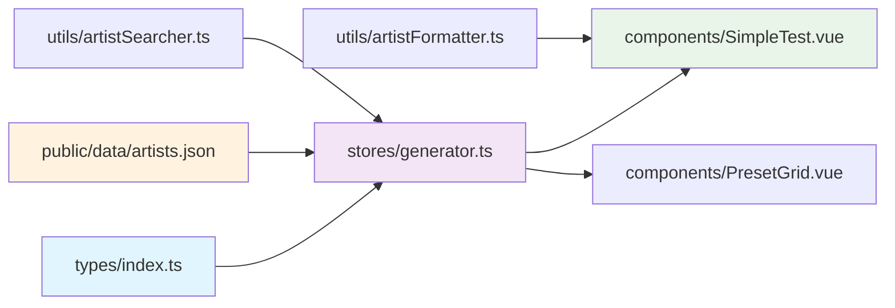
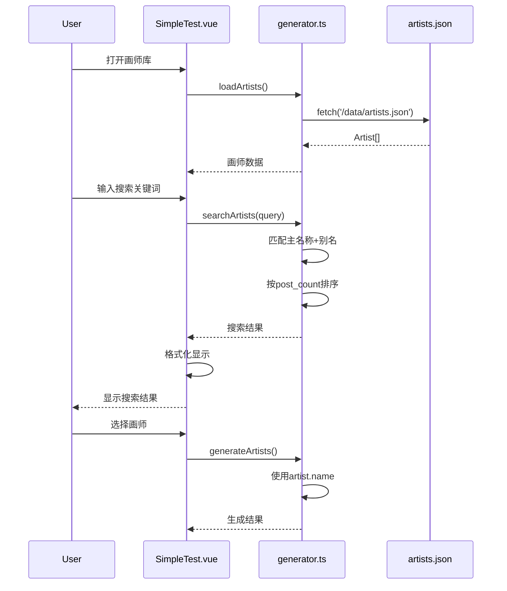

# 画师显示格式优化系统设计文档

## 整体架构图

```mermaid
graph TB
    A[数据层 - JSON文件] --> B[Store层 - Pinia]
    B --> C[组件层 - Vue Components]
    
    A1[danbooru_artists_*.json] --> B1[generator.ts]
    B1 --> C1[SimpleTest.vue]
    B1 --> C2[PresetGrid.vue]
    
    subgraph "数据结构转换"
        D1[旧格式: string[]] --> D2[新格式: Artist[]]
    end
    
    subgraph "搜索增强"
        E1[简单字符串匹配] --> E2[主名称+别名匹配]
        E2 --> E3[按作品数量排序]
    end
    
    subgraph "显示优化"
        F1[简单列表] --> F2[格式化显示]
        F2 --> F3[别名截断处理]
    end
```

## 分层设计和核心组件

### 1. 数据层 (Data Layer)
**文件**: `public/data/artists.json`
- **职责**: 存储画师数据
- **格式**: Artist对象数组
- **迁移**: 重命名现有数据文件

### 2. 类型层 (Type Layer)
**文件**: `src/types/index.ts`
- **新增类型**: Artist接口
- **更新类型**: ArtistData接口
- **保持兼容**: 现有生成相关类型

### 3. 状态管理层 (Store Layer)
**文件**: `src/stores/generator.ts`
- **数据加载**: 适配新的Artist对象结构
- **搜索逻辑**: 实现主名称+别名匹配
- **生成逻辑**: 保持使用主名称的兼容性

### 4. 组件层 (Component Layer)
**文件**: `src/components/SimpleTest.vue`
- **显示逻辑**: 实现新的格式化显示
- **搜索UI**: 保持现有搜索交互
- **分页逻辑**: 适配新的数据结构

## 模块依赖关系图



## 接口契约定义

### Artist接口
```typescript
interface Artist {
  name: string           // 主名称，必填
  other_names: string[]  // 别名数组，可为空数组
  post_count: number     // 作品数量，必须>=0
}
```

### ArtistData接口
```typescript
interface ArtistData {
  artists: Artist[]      // 画师数组，支持空数组
}
```

### 搜索结果接口
```typescript
interface SearchResult {
  artists: Artist[]      // 匹配的画师
  total: number         // 总匹配数
  query: string         // 搜索查询
}
```

### 格式化显示接口
```typescript
interface FormattedArtist {
  displayName: string   // 格式化后的显示名称
  originalArtist: Artist // 原始画师对象
}
```

## 数据流向图



## 异常处理策略

### 1. 数据加载异常
```typescript
// 降级策略：使用测试数据
const fallbackArtists: Artist[] = [
  { name: "test_artist", other_names: [], post_count: 0 }
]
```

### 2. 搜索异常
```typescript
// 容错处理：返回空结果而不是错误
const safeSearch = (query: string): Artist[] => {
  try {
    return performSearch(query)
  } catch (error) {
    console.warn('搜索失败，返回空结果', error)
    return []
  }
}
```

### 3. 格式化异常
```typescript
// 安全格式化：确保始终有可显示的内容
const safeFormat = (artist: Artist): string => {
  try {
    return formatArtist(artist)
  } catch (error) {
    return artist.name || 'Unknown Artist'
  }
}
```

## 核心算法设计

### 1. 搜索匹配算法
```typescript
const searchArtists = (artists: Artist[], query: string): Artist[] => {
  const lowerQuery = query.toLowerCase().trim()
  if (!lowerQuery) return []
  
  return artists
    .filter(artist => {
      // 主名称匹配
      if (artist.name.toLowerCase().includes(lowerQuery)) return true
      // 别名匹配
      return artist.other_names.some(name => 
        name.toLowerCase().includes(lowerQuery)
      )
    })
    .sort((a, b) => b.post_count - a.post_count) // 按作品数降序
}
```

### 2. 显示格式化算法
```typescript
const formatArtist = (artist: Artist): string => {
  const { name, other_names, post_count } = artist
  
  let otherNamesStr = ''
  if (other_names.length > 0) {
    if (other_names.length <= 4) {
      otherNamesStr = other_names.join(',')
    } else {
      const shown = other_names.slice(0, 4).join(',')
      const remaining = other_names.length - 4
      otherNamesStr = `${shown}...等${remaining}个别名`
    }
  }
  
  return `${name} - ${otherNamesStr} - ${post_count}`
}
```

## 性能优化考虑

### 1. 搜索防抖
```typescript
const debouncedSearch = debounce((query: string) => {
  performSearch(query)
}, 300)
```

### 2. 大数据分页
```typescript
const ITEMS_PER_PAGE = 50
const paginateResults = (results: Artist[], page: number) => {
  const start = (page - 1) * ITEMS_PER_PAGE
  return results.slice(start, start + ITEMS_PER_PAGE)
}
```

### 3. 搜索结果缓存
```typescript
const searchCache = new Map<string, Artist[]>()
const cachedSearch = (query: string): Artist[] => {
  if (searchCache.has(query)) {
    return searchCache.get(query)!
  }
  const results = performSearch(query)
  searchCache.set(query, results)
  return results
}
```
