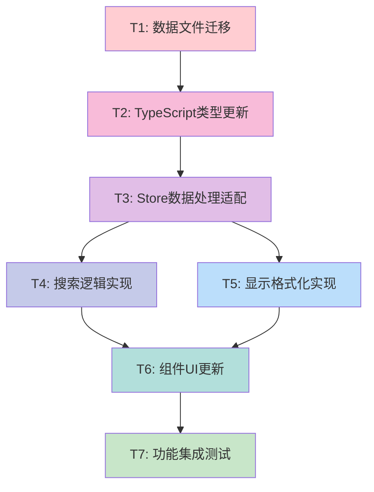

# 画师显示格式优化任务拆分文档

## 任务依赖关系图

## 原子任务详细定义

### T1: 数据文件迁移
**输入契约**:
- 前置依赖: 无
- 输入数据: `danbooru_artists_test_20250920_165108_merged.json`
- 环境依赖: 文件系统访问权限

**输出契约**:
- 输出数据: 重命名为 `public/data/artists.json`
- 交付物: 更新后的数据文件
- 验收标准: 文件路径正确，JSON格式有效

**实现约束**:
- 保持JSON格式完整性
- 确保文件路径符合现有加载逻辑
- 备份原有文件（如果存在）

**依赖关系**:
- 后置任务: T2 (类型更新需要新数据结构)
- 并行任务: 无

---

### T2: TypeScript类型更新
**输入契约**:
- 前置依赖: T1 (需要确认数据结构)
- 输入数据: 新的Artist数据结构
- 环境依赖: TypeScript编译环境

**输出契约**:
- 输出数据: 更新的类型定义
- 交付物: `src/types/index.ts` 更新
- 验收标准: TypeScript编译无错误，类型定义完整

**实现约束**:
- 保持现有类型的向后兼容性
- 新增Artist和相关接口
- 更新ArtistData接口

**依赖关系**:
- 后置任务: T3 (Store需要新类型定义)
- 并行任务: 无

---

### T3: Store数据处理适配
**输入契约**:
- 前置依赖: T2 (需要新类型定义)
- 输入数据: Artist类型定义
- 环境依赖: Pinia store环境

**输出契约**:
- 输出数据: 适配后的数据加载逻辑
- 交付物: `src/stores/generator.ts` 更新
- 验收标准: 数据加载成功，类型安全

**实现约束**:
- 保持现有store接口兼容性
- 更新loadArtists方法
- 保持生成逻辑使用主名称

**依赖关系**:
- 后置任务: T4, T5 (搜索和显示需要store支持)
- 并行任务: 无

---

### T4: 搜索逻辑实现
**输入契约**:
- 前置依赖: T3 (需要store数据支持)
- 输入数据: Artist数组和搜索查询
- 环境依赖: Vue响应式环境

**输出契约**:
- 输出数据: 增强的搜索功能
- 交付物: 主名称+别名搜索逻辑
- 验收标准: 搜索匹配准确，结果按作品数排序

**实现约束**:
- 支持主名称和别名模糊匹配
- 搜索结果按post_count降序排序
- 实现搜索防抖优化

**依赖关系**:
- 后置任务: T6 (组件需要搜索功能)
- 并行任务: T5 (可与显示格式化并行开发)

---

### T5: 显示格式化实现
**输入契约**:
- 前置依赖: T3 (需要store数据支持)
- 输入数据: Artist对象
- 环境依赖: Vue模板渲染环境

**输出契约**:
- 输出数据: 格式化的显示字符串
- 交付物: 显示格式化逻辑
- 验收标准: 显示格式符合规范，别名截断正确

**实现约束**:
- 格式: "name - other_names - post_count"
- 别名超过4个时截断显示
- 处理空别名数组情况

**依赖关系**:
- 后置任务: T6 (组件需要格式化功能)
- 并行任务: T4 (可与搜索逻辑并行开发)

---

### T6: 组件UI更新
**输入契约**:
- 前置依赖: T4, T5 (需要搜索和格式化功能)
- 输入数据: 增强的搜索和格式化功能
- 环境依赖: Vue组件环境

**输出契约**:
- 输出数据: 更新的用户界面
- 交付物: `src/components/SimpleTest.vue` 更新
- 验收标准: UI显示正确，交互流畅

**实现约束**:
- 保持现有UI布局和样式
- 集成新的搜索和显示逻辑
- 保持分页和模态框功能

**依赖关系**:
- 后置任务: T7 (需要完整功能进行测试)
- 并行任务: 无

---

### T7: 功能集成测试
**输入契约**:
- 前置依赖: T6 (需要完整功能实现)
- 输入数据: 完整的功能实现
- 环境依赖: 开发和测试环境

**输出契约**:
- 输出数据: 测试验证结果
- 交付物: 功能测试报告
- 验收标准: 所有验收标准通过，无明显bug

**实现约束**:
- 测试所有核心功能
- 验证边界情况处理
- 确保性能满足要求

**依赖关系**:
- 后置任务: 无
- 并行任务: 无

## 任务复杂度评估

| 任务ID | 任务名称 | 复杂度 | 预估时间 | 风险等级 |
|--------|----------|---------|----------|----------|
| T1 | 数据文件迁移 | 低 | 5分钟 | 低 |
| T2 | TypeScript类型更新 | 中 | 15分钟 | 低 |
| T3 | Store数据处理适配 | 中 | 20分钟 | 中 |
| T4 | 搜索逻辑实现 | 高 | 25分钟 | 中 |
| T5 | 显示格式化实现 | 中 | 15分钟 | 低 |
| T6 | 组件UI更新 | 高 | 30分钟 | 中 |
| T7 | 功能集成测试 | 中 | 20分钟 | 低 |

**总计预估时间**: 约2小时
**关键路径**: T1 → T2 → T3 → T4 → T6 → T7

## 质量门控检查点

### 每个任务完成后检查
- [ ] 代码编译无错误
- [ ] 类型检查通过
- [ ] 基本功能正常
- [ ] 无明显性能问题

### 整体完成后检查
- [ ] 所有验收标准满足
- [ ] 用户体验流畅
- [ ] 代码质量符合规范
- [ ] 文档更新完整
